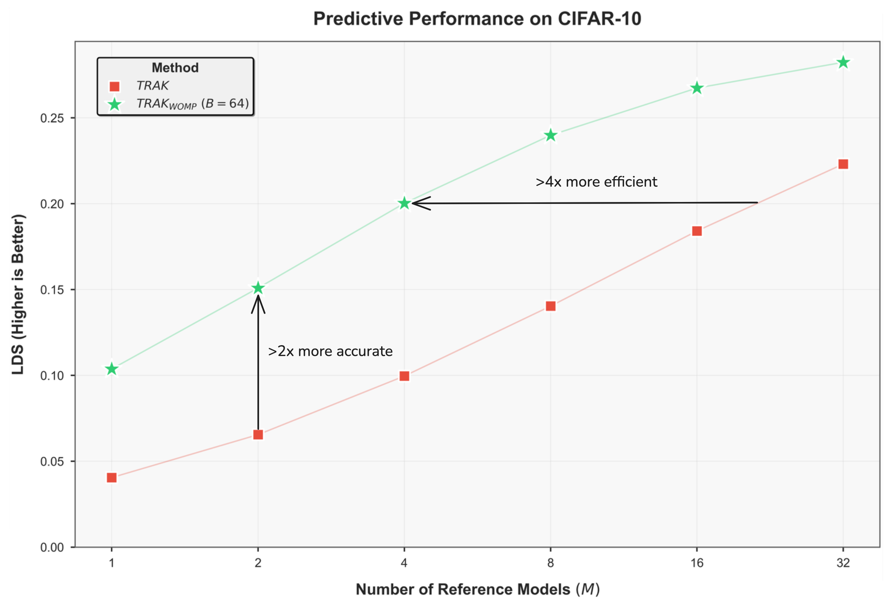
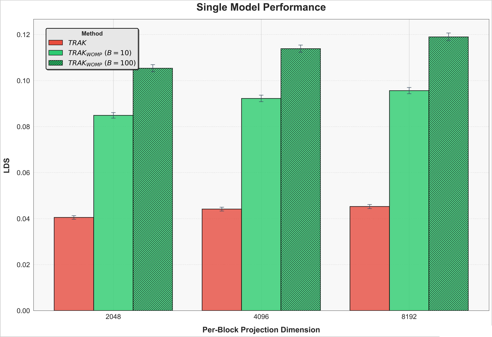
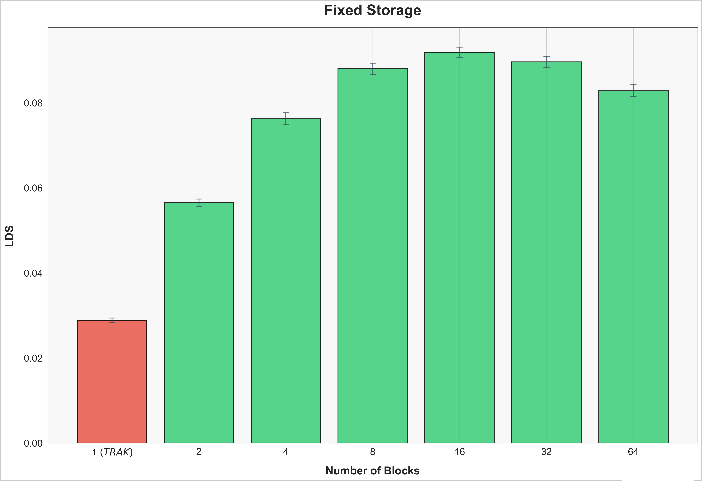

<h1 align="center">A New SOTA in Data Attribution</h1>

{width=70% style="display: block; margin: 0 auto;"}

## In this post we outline our method, $TRAK\ W_{ith}\ O_{ptimally}\ M_{odified}\ P_{rojections}$, which sets a new SOTA for predicting the downstream effects of dataset changes!

At Womp Labs, we spend all of our time thinking about the way ML models use their training data. When a model fails, it would be great to pinpoint the source of the problem. When you have many data sources, you'd like to know if only one of them was doing the heavy lifting.

The methods used to solve these problems fall under the umbrella of data attribution. Fundamentally, this is a challenge of tracing model outputs to training data, and then using this understanding to infer how to change data to affect downstream behavior. Some background can be found in [this ICML tutorial](https://ml-data-tutorial.org/assets/DataTutorialICML2024.pdf).

## Warmup

### The Linear Datamodeling Score (LDS)

A core goal is to accurately predict the outcome of training on some dataset without having to do so. To quantify how good a method is at this, we can use the following:

$$LDS(\tau,z):=\rho(f(z,\theta^*(D_j)):j\in[m],{g_\tau(z,D_j;D):j\in[m]})\tag{1}$$

where $D$ is the training set, $f$ is the output of model $\theta^*$, trained on $D_j\subset D$, on example of interest $z$, $m$ is number of evaluation subsets, and $g_\tau$ is the output prediction made by attribution method $\tau$. In simpler terms, we are trying to answer the following question:

$$How\ accurately\ can\ we\ predict\ which\ dataset\ is\ better\ for\ learning\ example\ z?$$

### TRAK

Just over a year ago, a lab at MIT introduced [TRAK](https://arxiv.org/abs/2303.14186), a data attribution method orders of magnitudes more efficient than the prior *state of the art*. Their approach casts the complex problem of attributing influence in neural nets to the well understood setting of linear regression. Leaving the details to their paper, the final form of their method is as follows:

$$\tau_{TRAK}(z,S) := S(\frac{1}{M^2}(\sum_{m=1}^M Q_m)*(\sum_{m=1}^M\phi_m(z)(\Phi_m^T\Phi_m)^{-1}\Phi_m^T),\hat\lambda)\tag{2}$$

where $z$ is an example of interest, $M$ is the number of reference models used, $\phi$ is a random projection of $\nabla_\theta f(z)$, $\Phi$ is the stacked matrix of $\phi(x)$ for all training examples $x$, $Q$ is the diagonal matrix of $1-p_i$, and $S$ is a soft threshold function with threshold $\hat\lambda$.

### Random Projections and the JL Lemma

One of the understood sources of error in the TRAK formulation is the random projection step. However, a theoretical result from [Johnson and Lindenstrauss](https://stanford.edu/class/cs114/readings/JL-Johnson.pdf), which shows inner products are preserved with high probability when projecting via a matrix $P\sim\mathcal{N}(0,1)^{p\times{k}}$, leads to the belief that this error is small. As a result, the ensembling improvement from $M$ different models is attributed to the need for different training trajectories to sample different possible loss landscapes.

We show that this is not entirely the case. In fact, a large portion of the error comes from imperfections in the projection step.

### Projection Dimension and the $H^{-1}$ Approximation

To reduce this degradation in accuracy, one can increase the projection dimension. But, the TRAK paper shows that there is an optimal projection dimension, beyond which performance starts to degrade. While we expect higher resolution representations to be less lossy, the issue comes from the inverse Hessian approximation $(\Phi_m^T\Phi_m)^{-1}$. As dimensionality increases, the number of spurious correlations grows. But, a small tweak to the setup fixes this problem.

## TRAK With Optimally Modified Projections (WOMP)$\ _{haha,\ see\ what\ we\ did\ there}$

We modify TRAK by decomposing the projected gradients into blocks. In doing so, we produce what resembles multiple checkpoints from a single backward pass. For example, one checkpoint projected to $d=4096$ can also be treated as $4$ different $d_{batch}=1024$ checkpoints. The result is the following formulation:

$$\tau_{TRAK_{WOMP}}(z,S) := S(\frac{1}{M^2}(\sum_{m=1}^M Q_m)*(\sum_{m=1}^M\sum_{b=1}^B\phi_{m,b}(z)(\Phi_{m,b}^T\Phi_{m,b})^{-1}\Phi_{m,b}^T),\hat\lambda)\tag{3}$$

where $B$ is the number of blocks we decompose the projection into and $\phi_{m,b}(z)$ is the $b^{th}$ block of $\phi_{m}(z)$.

### An Equivalent Definition

An alternative way to frame our setup is as a block-wise decomposition of the $H^{-1}$ approximation. We redefine this term as:

$$\hat{H}_m^{-1} := diag(\Phi_{m,1}^T\Phi_{m,1},\Phi_{m,2}^T\Phi_{m,2},...,\Phi_{m,B}^T\Phi_{m,B})^{-1}\tag{4}$$

Finally, equivalent to $(3)$, we come to the definition:

$$\tau_{TRAK_{WOMP}}(z,S) := S(\frac{1}{M^2}(\sum_{m=1}^M Q_m)*(\sum_{m=1}^M\phi_{m}(z){\hat{H}_m}^{-1}\Phi_{m}^T),\hat\lambda)\tag{5}$$

Our simple change allows us to increase the projection dimension, thereby achieving higher resolution representations, without sacrificing the accuracy of the hessian approximation. What is nice about this setup is it introduces no additional backward passes per reference model.

$$This\ lets\ us\ make\ better\ predictions\ without\ multi-million\ dollar\ donations\ to\ NVIDIA!$$

## Evaluating $TRAK_{WOMP}$

### Setup

Our goal is to accurately predict the result of training a $Resnet-9$ on a given subset of $CIFAR10$ without having to train the model. To make these predictions we train $M$ models on random $50\%$ subsets of the dataset. We use checkpoints from these models to compute attribution scores. We then evaluate the methods with $LDS$ using $10,000$ models.

### Results

{width=70% style="display: block; margin: 0 auto;"}

In most settings it is not feasible to retrain multiple models. As a result, the most important measure of effectiveness is the case of $M=1$. We show that $TRAK_{WOMP}$ drastically outperforms vanilla $TRAK$.

{width=70% style="display: block; margin: 0 auto;"}

So far, we have shown results when per-block projection dimension was fixed. However, we know this requires $B\ times$ more storage. In some cases there can be storage constraints as well. In *Figure 3*, we fix the total projection dimension, $d$, and vary $B$. Out results show that, not only is $TRAK_{WOMP}$ superior on a fixed compute budget, it is better on a fixed storage budget as well.

## More To Come ...

We know these results are on a small scale model, but we have more to share soon on billion(s) parameter models and internet scale datasets. We believe there doesn't need to be *hope* and *guesswork* when training large models. If you agree and are interested in collaborating or joining the team, please reach us at [contact@womplabs.ai](mailto:contact@womplabs.ai)! If you would like to stay up to date on our work, [sign up here](https://forms.gle/vzDzFeeW4d9jFjRJ7).

See you next time 🙂